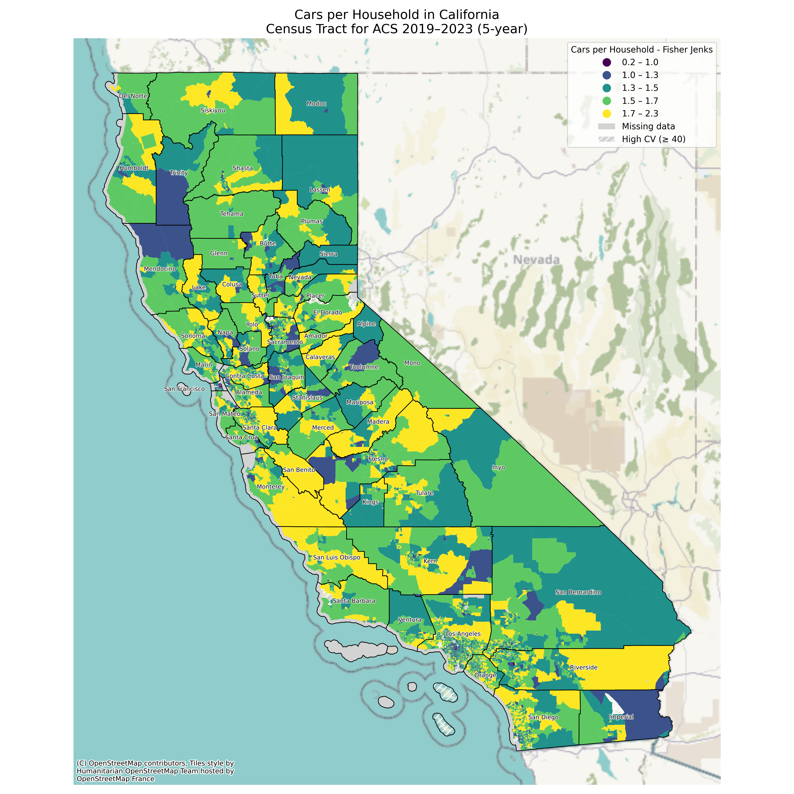

# Interlinking EV Charging Infrastructure with Urban Fabric of California
## Samruddhi Purohit
## Command Line GIS

## Overview
This project examines EV infrastructure and its linkage to Orange County’s employment geography. It opens with a national-to-regional scan of cars-per-household at the census-tract level, then narrows to Orange County to analyze charger deployment year by year (2021–2024) using county-level datasets. While the source data distinguish Shared, Shared Private, Level 1, Level 2, and DC Fast chargers (useful for future, finer analysis), this phase aggregates to total chargers to establish the big picture. Building on research that finds a direct correlation between charger locations and commercial zones, the study specifically tests the relationship between EV chargers and office locations in Orange County. To assess practical access for commuters, we evaluate walkable catchments around office sites using 5-, 10-, and 15-minute buffers, highlighting where workplace-proximate charging may influence adoption, parking behavior, and last-mile choices.

## Data Sources
- Source 1 — format, year
- Source 2 — format, year 

## Coordinate Reference System (CRS)

## Methods
Brief bullets of your workflow:
1. Collect data
2. Clean/clip (e.g., dissolve, buffer)
3. Spatial join / network analysis
4. Map layout & export
5. <iframe src="ev_chargers_popden_map.html" height ="555" width="1205"></iframe> You can explore this map [as its own web page here](ev_chargers_popden_map.html)
<iframe src="ca_cars_per_hh_fisherjenks_counties_quality.png" height="550" width="10%"></iframe>
</iframe>
</iframe>
